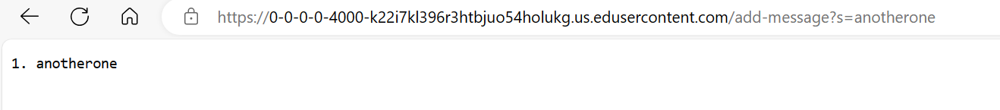
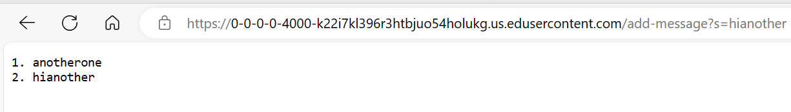
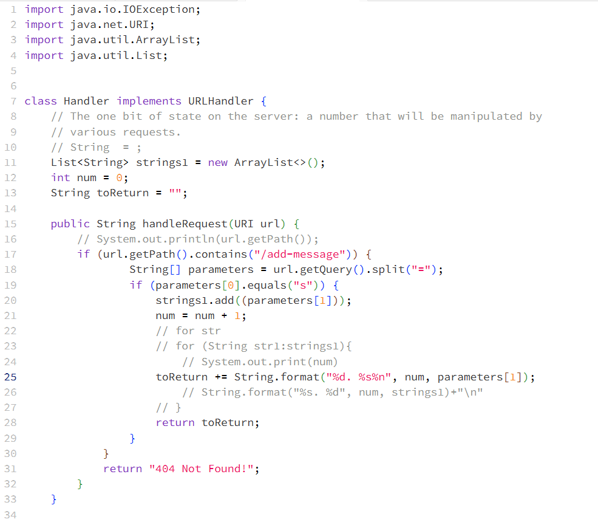

# Lab Report 2

## Part 1
-   
The handleRequest method in my code is called.
The relevant argument to this method is url. The value of url is https://0-0-0-0-4000-k22i7kl396r3htbjuo54holukg.us.edusercontent.com/add-message?s=anotherone
The values of the fields num, parameters[0], parameters[1], and strings1 change and become 1, s, anotherone, [anotherone] from through this specific request.

-   
Similar to the above picture, the handleRequest method in my code is called.
The relevant argument to this method is url. The value of url is https://0-0-0-0-4000-k22i7kl396r3htbjuo54holukg.us.edusercontent.com/add-message?s=hianother
The values of the fields num, parameters[0], parameters[1], and strings1 change and become 2, s, hianother, [anotherone, hianother] from through this specific request.

-   

## Part 2
-   

## Part 3
This week I learned a lot more about paths in general and servers. I would always see the ssh command being used but I never knew what it was used for. Therefore, I'm very glad I learned that ssh allows you to run commands on another computer.
