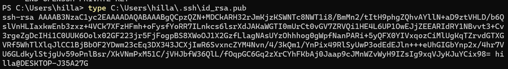
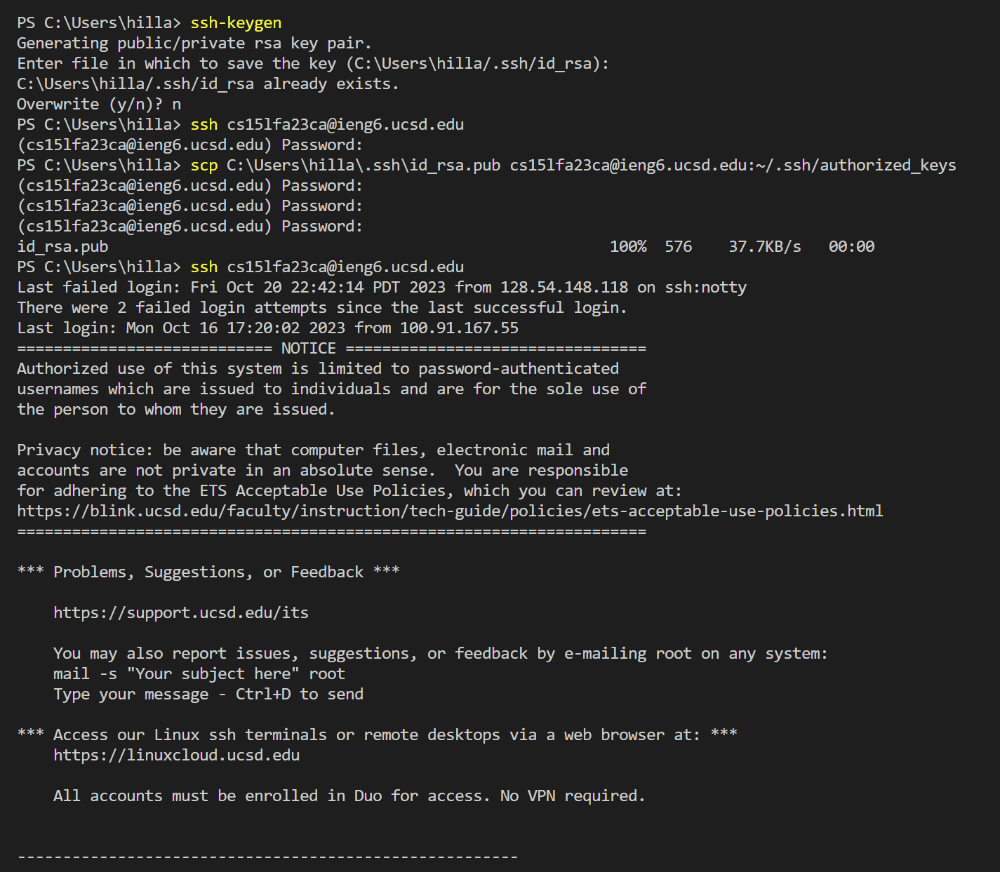

# Lab Report 2

## Part 1
-   
The handleRequest method in my code is called.
The relevant argument to this method is url. The value of url is https://0-0-0-0-4000-k22i7kl396r3htbjuo54holukg.us.edusercontent.com/add-message?s=anotherone
The values of the fields num, parameters[0], parameters[1], and strings1 change and become 1, s, anotherone, [anotherone] from through this specific request.

-   
Similar to the above picture, the handleRequest method in my code is called.
The relevant argument to this method is url. The value of url is https://0-0-0-0-4000-k22i7kl396r3htbjuo54holukg.us.edusercontent.com/add-message?s=hianother
The values of the fields ```num```, ```parameters[0]```, ```parameters[1]```, and ```strings1``` change and become ```2```, ```s```, ```hianother```, ```[anotherone, hianother]``` from through this specific request.

-   

## Part 2
The private key is located at C:\Users\hilla\.ssh\id_rsa
-   
The public key is located at C:\Users\hilla\.ssh\id_rsa.pub
-   

-   


## Part 3
This week I learned a lot more about paths in general and servers. I would always see the ssh command being used but I never knew what it was used for. Therefore, I'm very glad I learned that ssh allows you to run commands on another computer. Also, I learned about public and private keys, and how they could be used to connect to a server, as since I have a private key on my local machine and a public key that I sent to the server (with scp), I could connect to the server without authentication.
