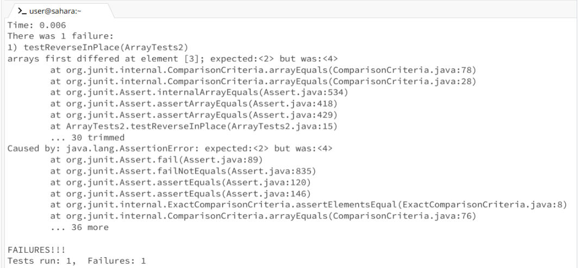
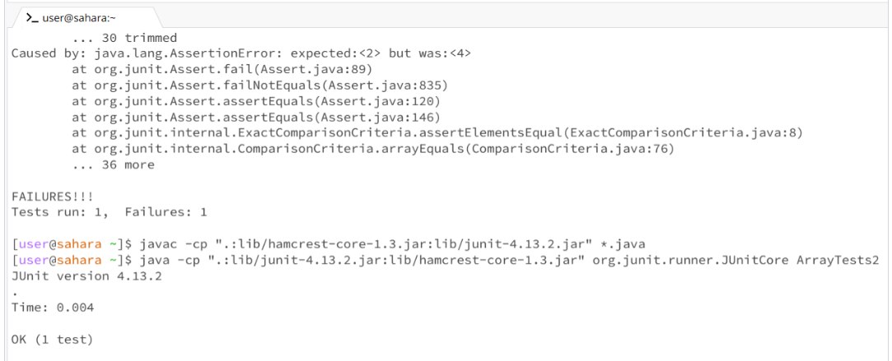
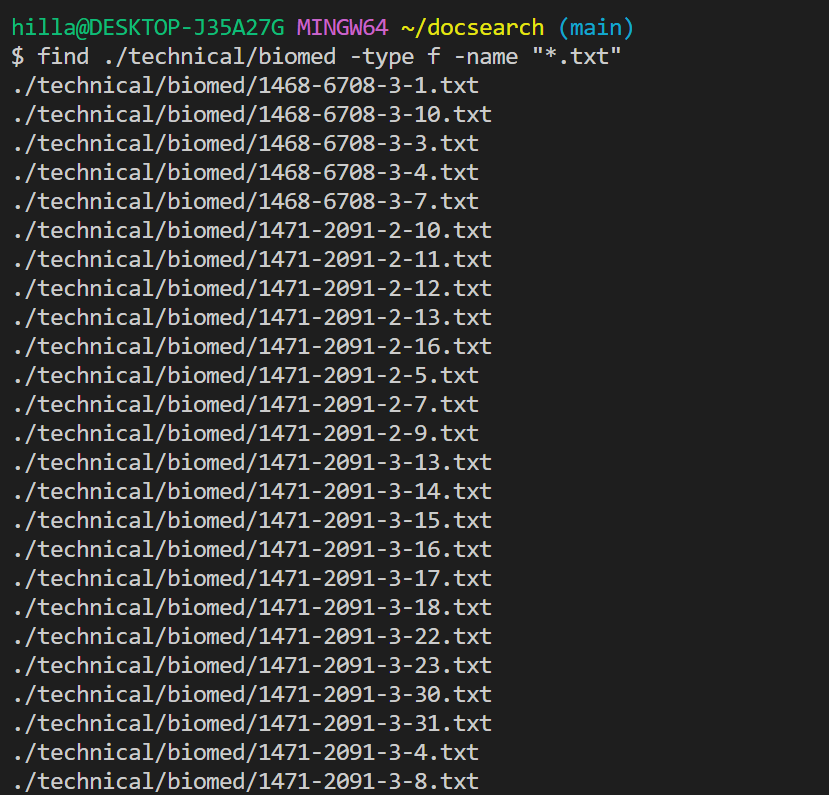
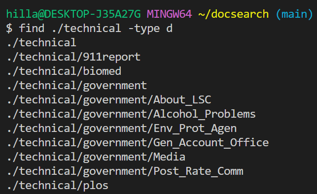
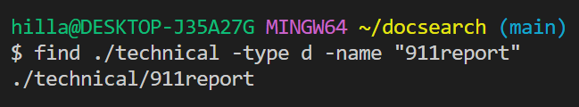
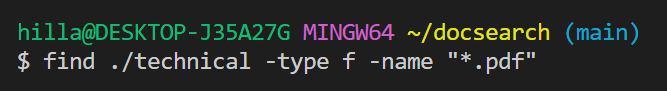

# Lab Report 3

## Part 1 - Bugs
The bug I chose from lab 4 is the bug in the following function.

```
static void reverseInPlace(int[] arr) {
  for(int i = 0; i < arr.length; i += 1) {
    arr[i] = arr[arr.length - i - 1];
  }
}
```

A failure-inducing input for the buggy program, as a JUnit test and any associated code is ```int[] inputArray = {1, 2, 3, 4, 5};```

An input that doesn’t induce a failure, as a JUnit test and any associated code ```int[] inputArray = {3, 3, 3, 3, 3}; ```

The symptom, as the output of running the tests (provide it as a screenshot of running JUnit with at least the two inputs above) 
-   

-   


The bug, as the before-and-after code change required to fix it 

Before code change:
``` 
static void reverseInPlace(int[] arr) {
  for(int i = 0; i < arr.length; i += 1) {
    arr[i] = arr[arr.length - i - 1];
  }
}
```

After code change:
```
static void reverseInPlace(int[] arr) {
    int length = arr.length;
    for (int i = 0; i < length / 2; i++) {
        int temp = arr[i];
        arr[i] = arr[length - i - 1];
        arr[length - i - 1] = temp;
    }
}
```
The fix I made was I changed the for loop so that it wasn’t iterating through the entire for loop. Because it was looping through the entire loop, the reversed elements were getting overridden and un-reversing it.

## Part 2 - Researching Commands: find
# Using -type Option:
```find ./technical/biomed -type f -name "*.txt"```
This command searches for all directories within the ./technical directory within the ./technical/biomed directory.
- 

```find ./technical -type d```
This command searches for all directories within the ./technical directory.
- 

# Using -name Option:
```find ./technical -type f -name "*911report*"```
This command searches for all directories within the ./technical directory.
- 

```find ./technical -type f -name "*.pdf"```
This command searches for all directories named 911report within the ./technical directory.
- 

# Using -size Option:

# Using -mtime Option:

The bug I chose from lab 4 is the bug in the following function.

```
static void reverseInPlace(int[] arr) {
  for(int i = 0; i < arr.length; i += 1) {
    arr[i] = arr[arr.length - i - 1];
  }
}
```

## Sources
I primarily found examples for the find command from the following sources:
https://www.redhat.com/sysadmin/linux-find-command
