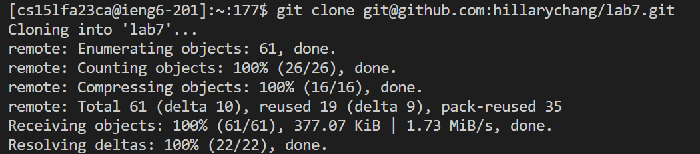

# Lab Report 4

## Log into ieng6

## Step 4
Clone your fork of the repository from your Github account (using the SSH URL)
Keys pressed: ```<up>``` ```<up>``` ```<up>``` ```<up>``` ```<up>``` ```<up>``` ```git clone https://github.com/hillarychang/lab7.git```

The git clone command was 6 up in the search history, so I used 6 up arrows to access it.
-   

## Step 5
Run the tests, demonstrating that they fail
Keys pressed: ```<up>``` ```<up>``` ```<up>``` ```<up>``` ```<up>``` ```<up>``` ```<up>``` ```<up>``` ```cd lab7```
```<up>``` ```<up>``` ```<up>``` ```<up>``` ```<up>``` ```<up>``` ```<up>``` ```<up>``` ```<up>``` ```chmod +x```
```<up>``` ```<up>``` ```<up>``` ```<up>``` ```<up>``` ```<up>``` ```<up>``` ```<up>``` ```<up>``` ```<up>``` ```./test.sh```

The git clone command was 8 up in the search history, so I used 8 up arrows to access it. Before that, I used 10 up arrows to cd into the lab7 directory (that contains ListExamples.java), and 9 up arrows to give myself execute permission to the file.  
-   

## Step 6
Edit the code file to fix the failing test
Keys pressed: ```<up>``` ```<up>``` ```<up>``` ```<up>``` ```<up>``` ```vim ListExamples.java```
```i``` ```del``` ```2``` ```esc``` ```:wq``` ```Enter``` 

I used 5 up arrows to run ```vim ListExamples.java```. After I opened ListExamples.java, my curser was already on the 1 in index1 of the , I cliked ```'i'``` to enter insert mode, then pressed 'del' to delete the 1, then pressed 2 to enter a 2 so that the variable name would now be index2 instead of index1. Then, I saved and exited the file by clicking ```'esc'``` to go back to normal mode and entering ```':wq' + Enter```. 
-   

## Step 7
Run the tests, demonstrating that they now succeed
Keys pressed: ```<up>``` ```<up>``` ```./test.sh```
-  

I used 2 up arrows to run ```./test.sh```.

## Step 8
Commit and push the resulting change to your Github account (you can pick any commit message!)
- 
Keys pressed: ```<up>``` ```<up>``` ```<up>``` ```<up>``` ```<up>``````<up>``````<up>``````<up>``````<up>``````<up>``````<up>``````<up>``````<up>``````<up>``````git add .```
```<up>``````<up>``````<up>``````<up>``````<up>``````<up>``````<up>``````<up>``````<up>``````<up>``````<up>``````<up>``````<up>``````git commit -m "add"```
```<up>``````<up>``````<up>``````<up>``````<up>``````<up>``````<up>``````<up>``````<up>``````<up>``````<up>``````<up>``````git pus origin``
```<up>``````<up>``````<up>``````<up>``````<up>``````<up>``````<up>``````<up>``````<up>``````<up>``````<up>``````git push origin```
 
I used 14 up arrows to run ```git add .```. Then, to commit, I used 13 up arrows to run ```git commit -m "add"```. I used 12 up arrows to accidentally run the wrong command to push: ```git pus origin```. I used 11 up arrows to run the correct command to push: ```git push origin```
