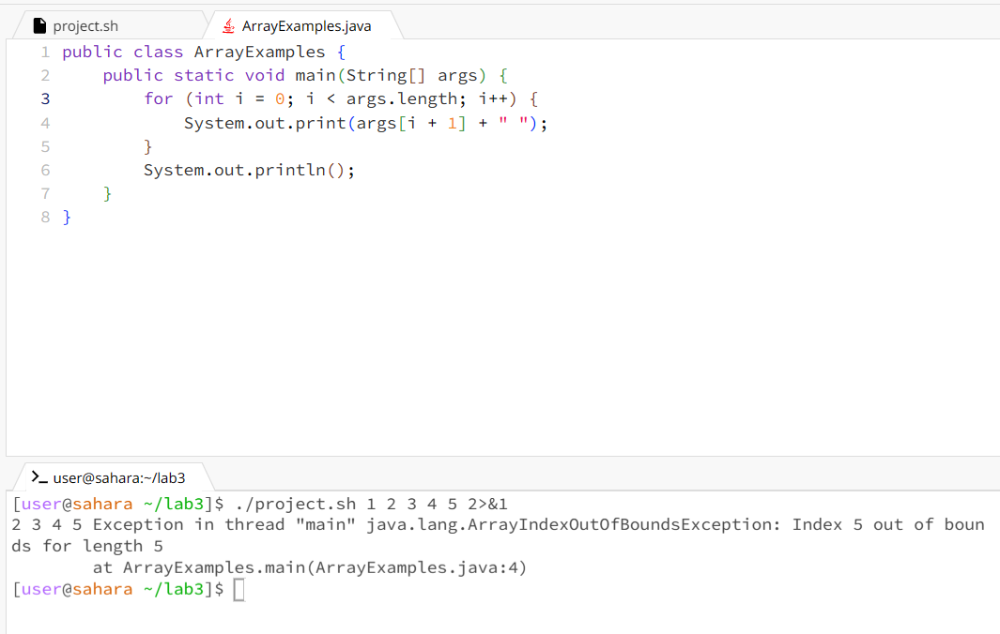
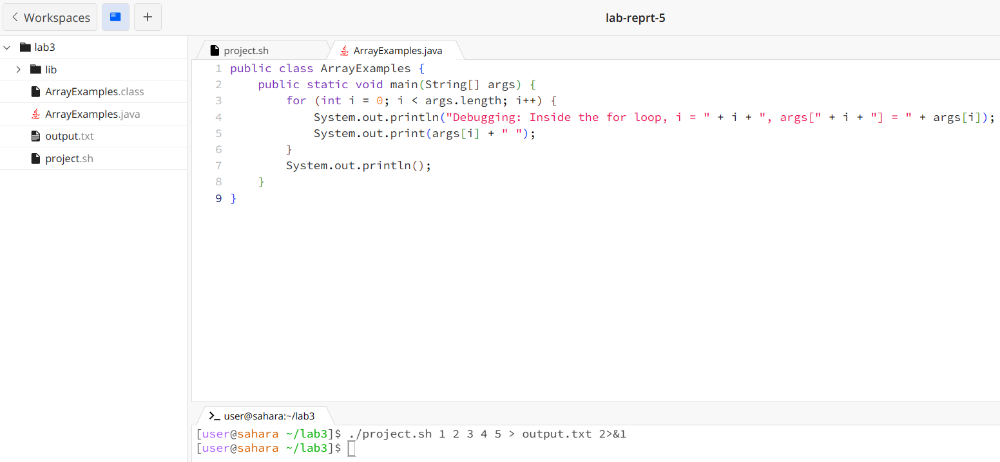
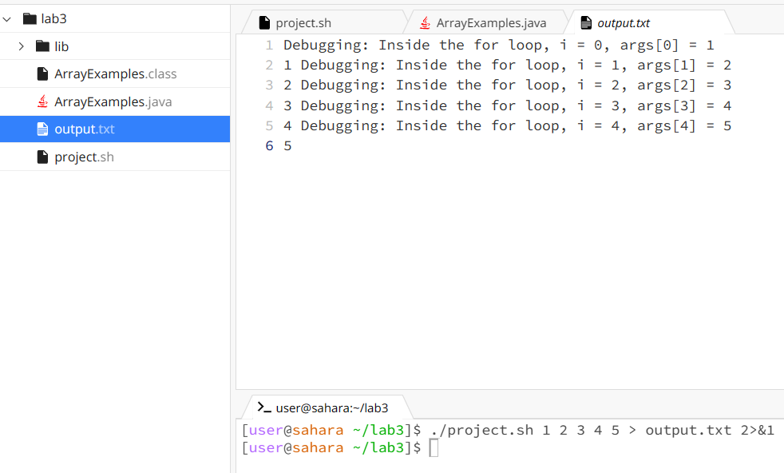

# Lab Report 5

## Part 1

Student: Hi, I'm currently working on a project, but I was encountering a strange issue. I've attached a screenshot of the error I'm getting, and I'd really appreciate some guidance with this!
  
I'm using a bash script project.sh to compile and run a Java program with arrays. I'm not sure why, but it's throwing a strange error. 

TA: Hi, thank you for your EdStem post. To help you better, could you please add this line in your for loop: ```System.out.println("Debugging: Inside the for loop, i = " + i + ", args[" + i + "] = " + args[i]);```
Then, could you run the following command and share the output with me?
```./project.sh 1 2 3 4 5 > output.txt 2>&1```
This command uses 1, 2, 3, 4, and 5 as command-line arguments to run the program. The command redirects both standard output and standard error to the console.

Student: Yes, I did as you told and this is the output:



Terminal Output after Running the Command:
After adding the print statement and running the ```./project.sh 1 2 3 4 5 > output.txt 2>&1``` command, the command ran the script and stored the output and any error messages in a file called output.txt

Bug Description:
The new bug is introduced in the MainClass.java file. The for loop that prints command-line arguments incorrectly uses args[i + 1] for indexing, leading to an ArrayIndexOutOfBoundsException.


Setup Information:

File & Directory Structure:
- ArrayExamples.java
- project.sh

ArrayExamples.java
```
public class ArrayExamples {
    public static void main(String[] args) {
        for (int i = 0; i < args.length; i++) {
            System.out.print(args[i + 1] + " ");
        }
        System.out.println();
    }
}
```

project.sh
```
javac ArrayExamples.java
java -cp . ArrayExamples "$@"
```

Command Line to Trigger the Bug:
```./project.sh 1 2 3 4 5```

Description of Fix:
To fix the bug, modify the MainClass.java file
```
public class ArrayExamples {
    public static void main(String[] args) {
        for (int i = 0; i < args.length; i++) {
            System.out.print(args[i + 1] + " ");
        }
        System.out.println();
    }
}
```
This modification ensures correct indexing of command-line arguments, avoiding the ArrayIndexOutOfBoundsException


## Part 2
